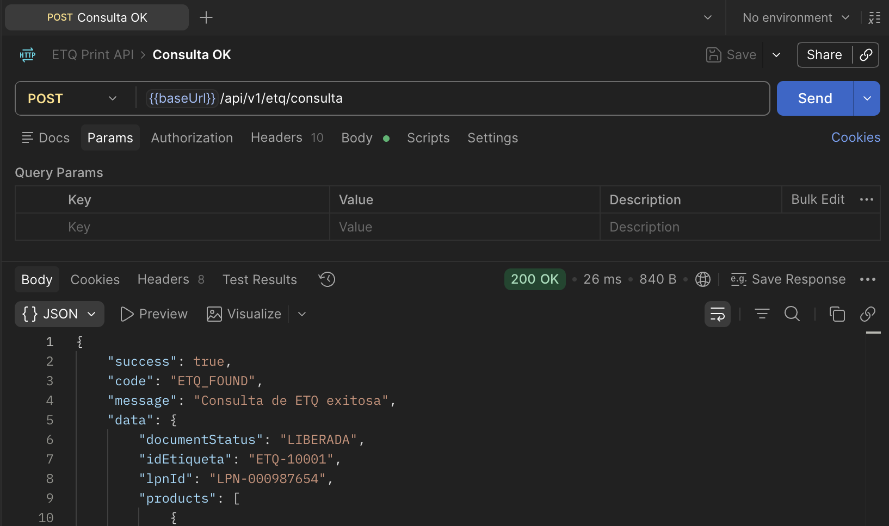
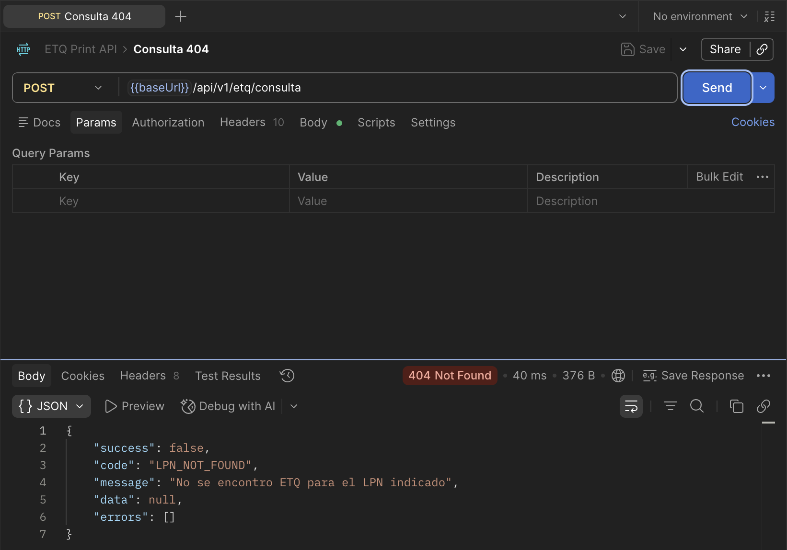
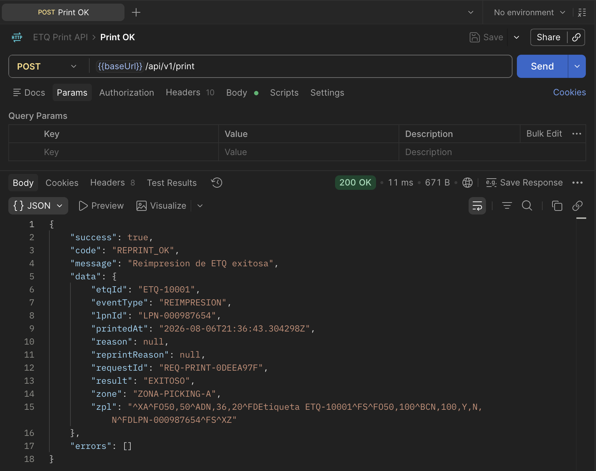
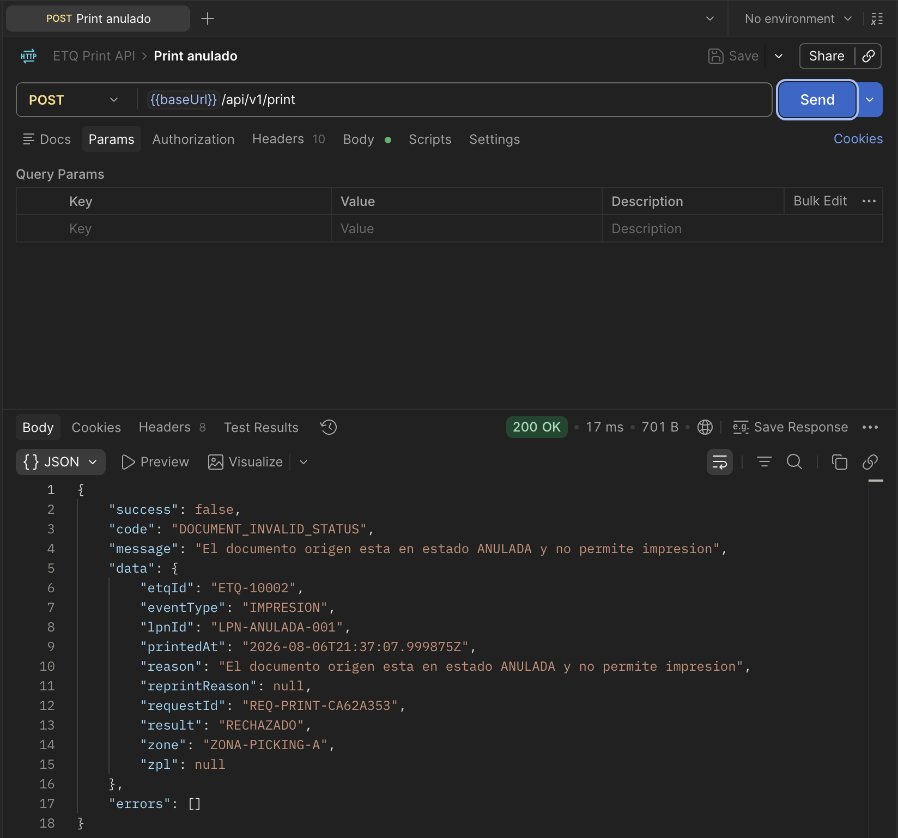
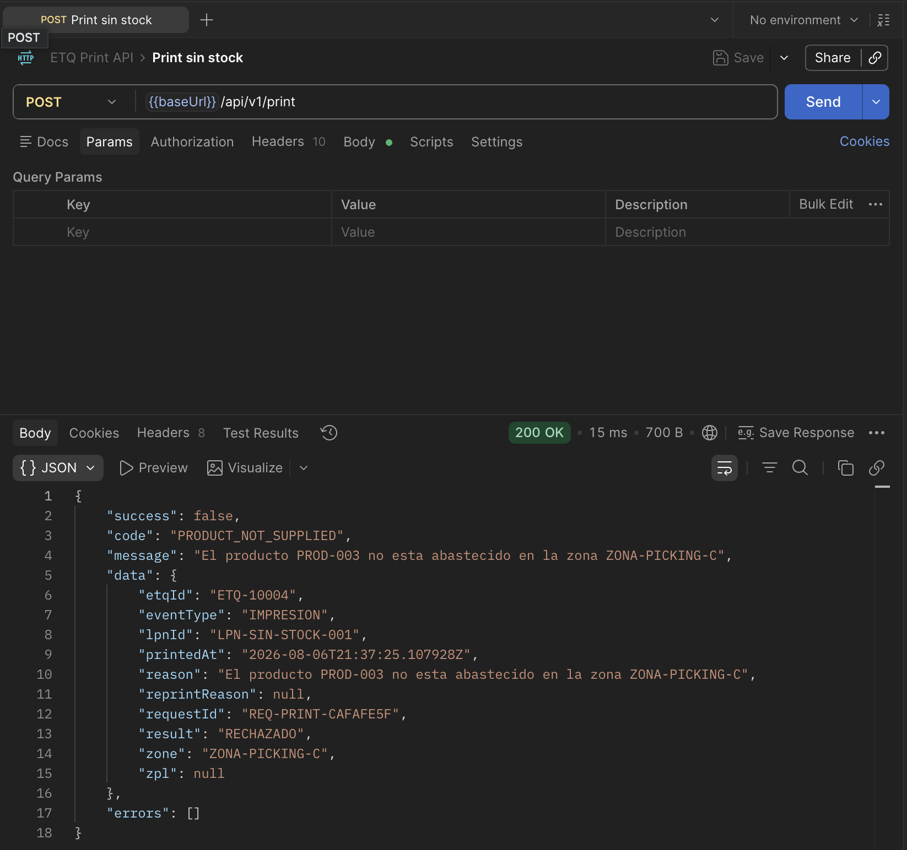
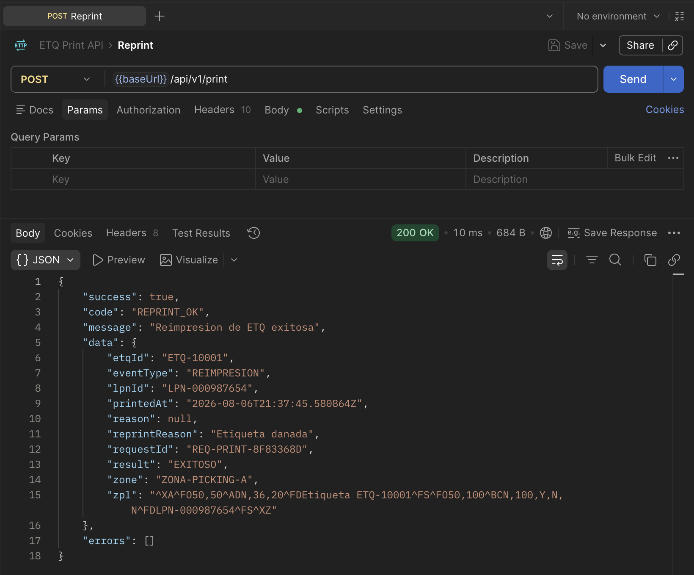
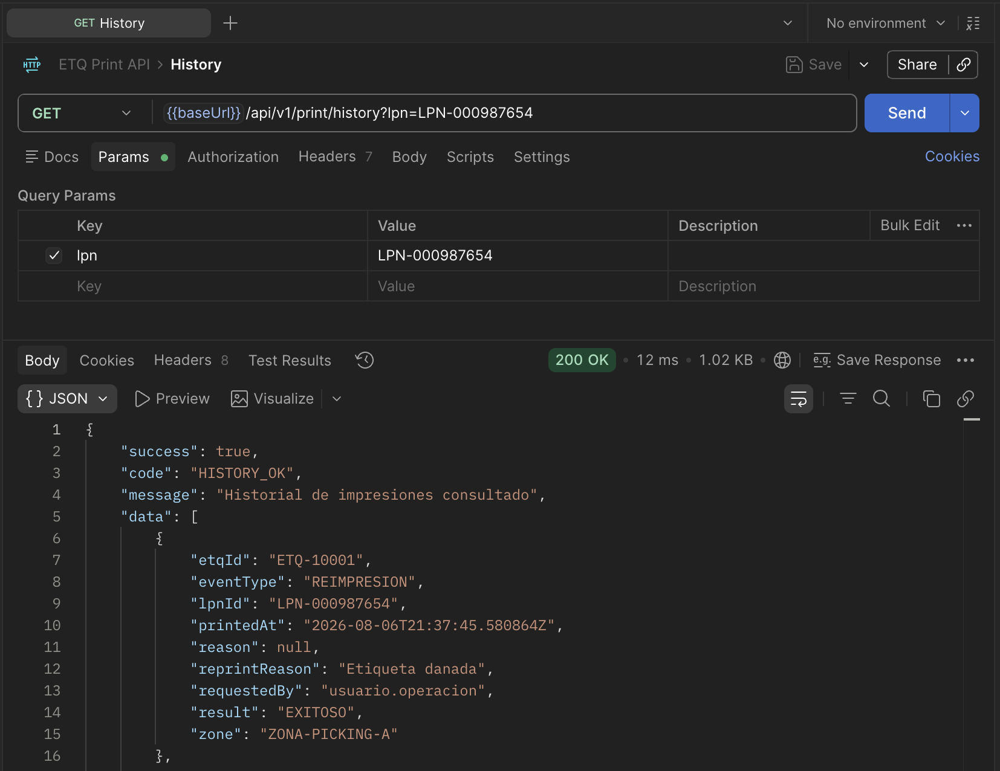

# Submódulo de impresión de ETQ

Prueba técnica GTL Tienda (Sodimac): solución fullstack desacoplada para consultar ETQ/LPN, validar reglas de negocio, simular impresión/reimpresión y consultar historial.

## Levantar con Docker (recomendado)

```bash
docker compose up --build
```

| Servicio | URL |
|----------|-----|
| UI | [http://localhost:4200](http://localhost:4200) |
| API / Health | [http://localhost:8080/api/v1/health](http://localhost:8080/api/v1/health) |
| Swagger | [http://localhost:8080/swagger-ui.html](http://localhost:8080/swagger-ui.html) |

El front (nginx) hace proxy de `/api` al backend; no hace falta configurar CORS para la UI en Docker.

## Levantar en local (sin Docker)

### 1. Backend (puerto 8080)

```bash
cd back-java
mvn spring-boot:run
```

Health: [http://localhost:8080/api/v1/health](http://localhost:8080/api/v1/health)  
Swagger: [http://localhost:8080/swagger-ui.html](http://localhost:8080/swagger-ui.html)

### 2. Frontend (puerto 4200)

```bash
cd front
npm install
npm start
```

UI: [http://localhost:4200](http://localhost:4200)

`ng serve` usa proxy de `/api` → `http://localhost:8080` ([`front/proxy.conf.json`](front/proxy.conf.json)).

## Módulos

| Carpeta | Rol |
|---------|-----|
| [`back-java/`](back-java/) | API Spring Boot (mocks, reglas, auditoría in-memory) |
| [`front/`](front/) | UI Angular (impresión + historial) |

## Demo rápida

1. En `/print`, consultar `LPN-000987654` (precarga zona).
2. Completar usuario e **Imprimir** → `PRINT_OK`.
3. Imprimir de nuevo → `REPRINT_OK`.
4. Abrir **Historial** y refrescar → eventos visibles.
5. Probar rechazo: `LPN-ANULADA-001` o `LPN-NO-EXISTE`.

## Documentación

| Documento | Contenido |
|-----------|-----------|
| [docs/video/test-funcional.mp4](docs/video/test-funcional.mp4) | Demo funcional de la UI |
| [back-java/README.md](back-java/README.md) | Cómo correr el API y estructura |
| [back-java/docs/API.md](back-java/docs/API.md) | Contratos HTTP y códigos |
| [back-java/docs/ARQUITECTURA.md](back-java/docs/ARQUITECTURA.md) | Capas y C4 del back |
| [back-java/docs/SUPUESTOS.md](back-java/docs/SUPUESTOS.md) | Decisiones de diseño y fuera de alcance |
| [back-java/docs/SOPORTE_PRODUCTIVO.md](back-java/docs/SOPORTE_PRODUCTIVO.md) | Escenario productivo (diagnóstico, comunicación, cierre) |
| [back-java/docs/PRUEBAS.md](back-java/docs/PRUEBAS.md) | Tests del backend |
| [front/README.md](front/README.md) | Cómo correr la UI |
| [front/docs/ARQUITECTURA.md](front/docs/ARQUITECTURA.md) | Capas FE y flujo UI→API |
| [front/docs/PRUEBAS.md](front/docs/PRUEBAS.md) | Tests del frontend |

## Demo en video

Recorrido funcional de la UI (consulta, impresión, reimpresión e historial):

<p align="center">
  <video src="docs/video/test-funcional.mp4" controls width="720">
    <a href="docs/video/test-funcional.mp4">Ver demo funcional</a>
  </video>
</p>

## Ejemplos Postman

Colección: [`back-java/postman/etq-print.postman_collection.json`](back-java/postman/etq-print.postman_collection.json)

### Consulta OK

`POST /api/v1/etq/consulta` → `ETQ_FOUND`

<p align="center">
  
</p>

### Consulta 404

LPN inexistente → `LPN_NOT_FOUND`

<p align="center">
  
</p>

### Print OK

Impresión exitosa → `PRINT_OK`

<p align="center">
  
</p>

### Print anulado

Documento inválido → `DOCUMENT_INVALID_STATUS`

<p align="center">
  
</p>

### Print sin stock

Inventario insuficiente → `INSUFFICIENT_INVENTORY`

<p align="center">
  
</p>

### Reprint

Reimpresión → `REPRINT_OK`

<p align="center">
  
</p>

### Historial

`GET /api/v1/print/history` → `HISTORY_OK`

<p align="center">
  
</p>

## Fuera de alcance

Generación de ETQ nuevas, impresoras físicas, sistemas corporativos reales (Oracle, Hub auth, APIM).
