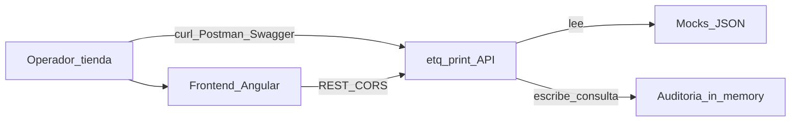
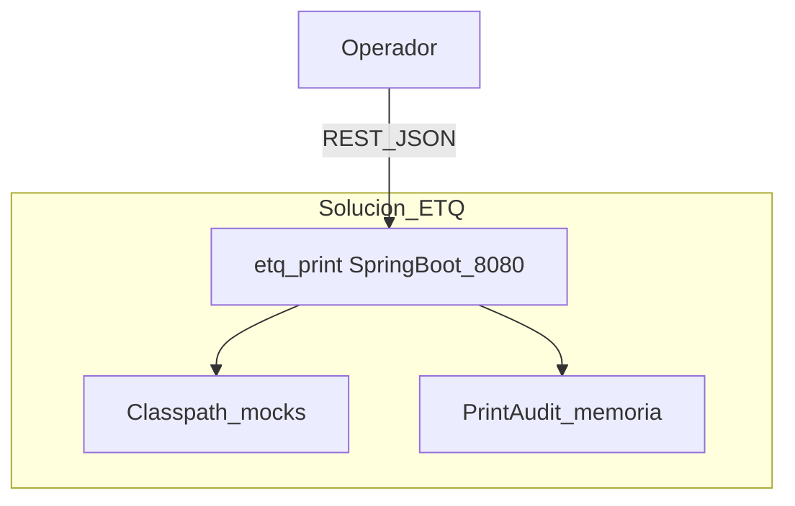
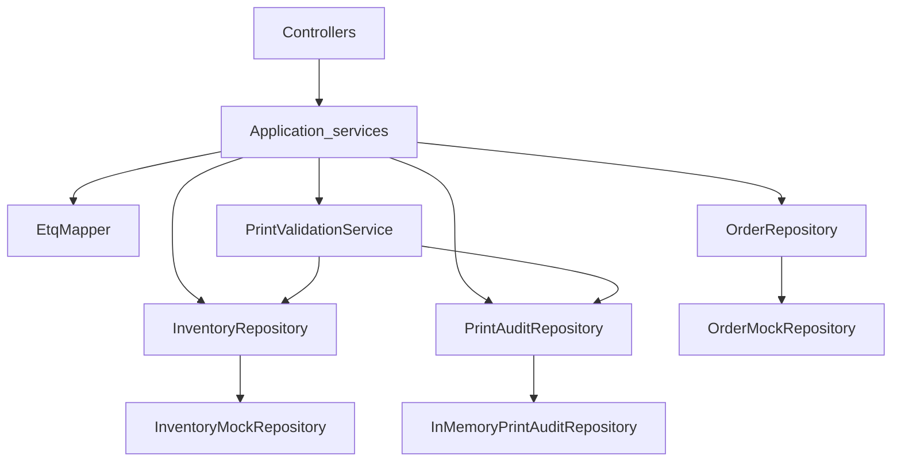

# Arquitectura — etq-print

Backend Spring Boot del submódulo de impresión de ETQ. Paquete base: `co.homecenter.etq`.

## Capas

```
api            Controllers, DTOs, excepciones, GlobalExceptionHandler
application    Services, mappers
domain         Modelos, enums, puertos (repositorios), reglas
infrastructure Mocks JSON, auditoría in-memory, CORS, OpenAPI
```

Dependencia: `api` → `application` → `domain`; `infrastructure` implementa los puertos de `domain`.

## SOLID (aplicación concreta)

| Principio | Ejemplo |
|-----------|---------|
| S | `PrintValidationService` solo valida reglas; no imprime ni persiste HTTP |
| O / D | Controllers dependen de interfaces (`EtqQueryService`, `PrintService`); repos son puertos |
| L / I | Impl mock e in-memory intercambiables tras el mismo contrato de repositorio |

## Flujo de impresión

1. El cliente consulta ETQ por LPN (`POST /api/v1/etq/consulta`) o envía impresión directa.
2. `PrintService` resuelve orden/label por LPN.
3. `PrintValidationService` aplica reglas de documento e inventario por zona.
4. Se registra auditoría (éxito o rechazo) en memoria.
5. Se responde con envelope unificado (`success`, `code`, `message`, `data`).

---

## C4

### Context



### Container



### Component


