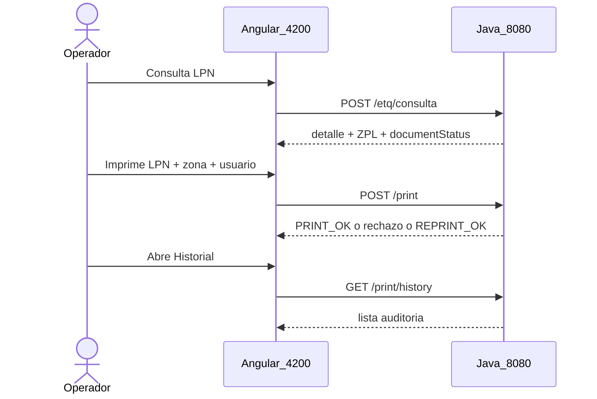
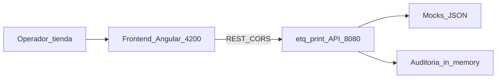

# Arquitectura — Frontend ETQ

UI Angular del submódulo de impresión de ETQ. App propia (sin plantilla Hub ni auth).

## Stack

- Angular 21 (standalone, signals, control flow `@if`/`@for`)
- Reactive Forms
- SCSS propio (sin PrimeNG/Tailwind de plantilla corporativa)
- `HttpClient` tipado contra `http://localhost:8080/api/v1`

## Capas

```
pages/       Orquestación de pantallas (print, history)
services/    HTTP tipado: Etq, Print, History, Health
core/        models (ApiResponse, DTOs) + utils (códigos, toUiFailure)
shared/      app-shell, etq-detail, print-result, api-failure
```

Las pages no hacen HTTP crudo: delegan en services. Los shared son presentacionales.

## Flujo UI → API



## Regla crítica: `success` vs HTTP

| Caso | HTTP | Cómo lo trata el FE |
|------|------|---------------------|
| Print OK / reimpresión | 200 | `success: true` → panel resultado |
| Print rechazo de negocio | **200** | `success: false` → panel rechazo (no es error RxJS) |
| Consulta LPN inexistente | **404** | `handleApiCall` → `UiFailure` |
| Validación body | 400 | `UiFailure` + `fieldErrors` mapeados al form |

La UI de impresión **no** decide solo por `status === 200`.

## C4 — Container



## Fuera de alcance (FE)

- Generar ETQ nuevas
- Impresora física / envío ZPL a dispositivo
- Login Hub, APIM, tokens
- Persistencia local de historial (el back es in-memory)
